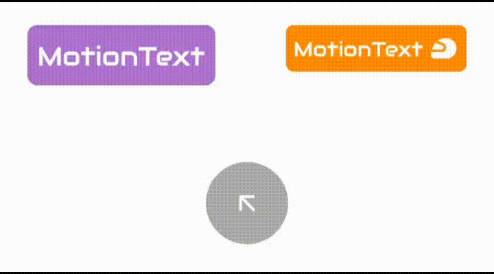

# MotionText
[](https://jitpack.io/#com.github.rajdeepvaghela/MotionText)
[](https://github.com/rajdeepvaghela/MotionText/releases)
[](https://opensource.org/licenses/Apache-2.0)


If you use a simple TextView in MotionLayout for textSize transitions, the animation won't be smooth. Here MotionText will solve the issue, as internally 
it will convert text to Image and during transition only the image is resized. It also have a few out of the box design attributes.

<div align="center">

</div>

## Installation
Add it in your root build.gradle at the end of repositories:
```gradle
allprojects {
    repositories {
    	...
        maven { url 'https://jitpack.io' }
    }
} 
```
Add the dependency
```gradle
dependencies {
    implementation 'com.github.rajdeepvaghela:MotionText:1.0.0'
}
```
## Usage
```xml
    <com.rdapps.motiontext.MotionText
        android:layout_width="wrap_content"
        android:layout_height="wrap_content"
        android:paddingHorizontal="5dp"
        android:paddingVertical="2dp"
        app:text="MotionText"
        app:textAllCaps="true"
        app:textColor="@color/textColor"
        app:textSize="14sp" />
```
You can also use these inbuild attributes to design it
```xml
    <com.rdapps.motiontext.MotionText
        android:layout_width="wrap_content"
        android:layout_height="wrap_content"
        android:paddingHorizontal="5dp"
        android:paddingVertical="2dp"
        app:backgroundColor="@color/backgroundColor"
        app:text="MotionText"
        app:cornerRadius="4dp"
        app:textColor="@color/textColor"
        app:textSize="12sp" />
```
Or add an icon on the right to it
```xml
    <com.rdapps.motiontext.MotionText
        android:layout_width="wrap_content"
        android:layout_height="wrap_content"
        android:paddingHorizontal="5dp"
        android:paddingVertical="2dp"
        app:icon="@drawable/ic_arrow_right"
        app:iconPadding="10dp"
        app:iconTint="#000000"
        app:text="Motion Text"
        app:textAllCaps="true"
        app:textColor="#000000"
        app:textSize="14sp" />
```
To create a pass through text enable this attribute
```xml
app:passThroughText="true"
```

## License
```
Copyright 2023 Rajdeep Vaghela

Licensed under the Apache License, Version 2.0 (the "License");
you may not use this file except in compliance with the License.
You may obtain a copy of the License at

    http://www.apache.org/licenses/LICENSE-2.0

Unless required by applicable law or agreed to in writing, software
distributed under the License is distributed on an "AS IS" BASIS,
WITHOUT WARRANTIES OR CONDITIONS OF ANY KIND, either express or implied.
See the License for the specific language governing permissions and
limitations under the License.
```
